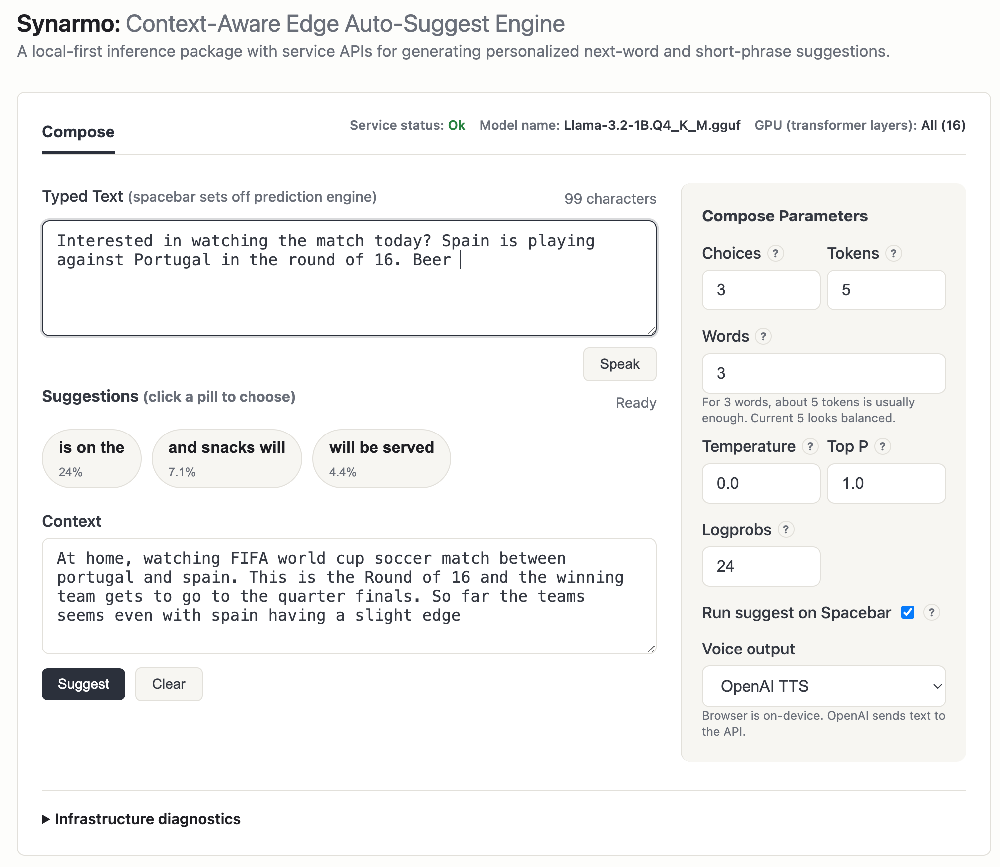
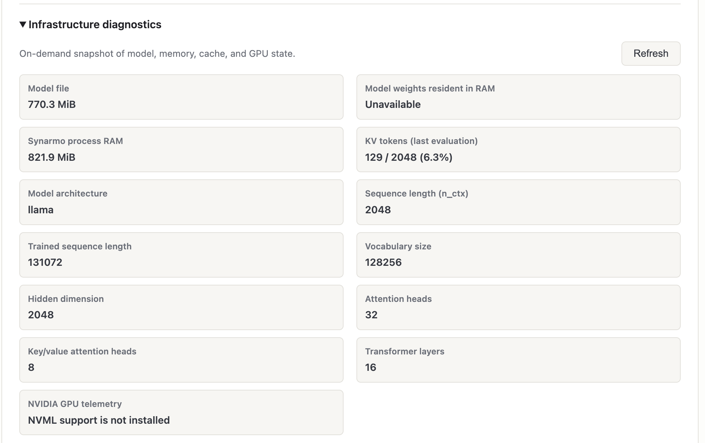

# Synarmo

[](https://github.com/vrraj/synarmo/actions)
[](https://pypi.org/project/synarmo/)
[](https://github.com/vrraj/synarmo/releases)

Synarmo (derived from *synarmozo* — "to fit together, to join closely") is a
local-first, low-latency auto-suggest engine and Python package for
personalized next-word and short-phrase predictions across messaging, chat, and
assistive typing workflows. It combines **context-aware local inference**, voice
output APIs, and llama.cpp/GGUF support for swappable local models.

It also includes optional **speech output** for the full text being composed:
instant on-device Browser TTS or server-side OpenAI TTS. This lets a user
communicate their complete typed message at the click of a button.


The repository includes an
[Interactive UI](#install---interactive-ui-git-clone) for evaluations and tuning
API calls with context and parameters. 
***


<p align="center"><em>Synarmo interactive browser UI for testing and tuning suggestions.</em></p>

***

## Use cases

Synarmo is intended to be used as:

- a PyPI package for predicting suggestions
- integration surfaces for other applications through REST and WebSocket
- an interactive browser `/ui` for testing and tuning API calls with context and parameters
- a llama.cpp/GGUF-backed engine that can run on CPU or supported GPUs such as Apple Metal, with model and GPU-layer settings controlled through `.env`
- a voice-assisted compose UI: the **Speak** button reads the complete typed text through Browser TTS or optional OpenAI TTS

The primary path uses a local GGUF model for inference through llama.cpp. For no-model verification checks of package install, CLI, service, or UI wiring, see
[Mock Mode](#mock-mode).

---

## Install - PyPI Package

**Note**: Synarmo uses [uv](https://docs.astral.sh/uv/) for dependency management. Install
`uv` first, then use one of the short setup paths below.

Use this when you want the published CLI:

```bash
uv tool install "synarmo[llama,service,voice-openai]"
synarmo setup
```

`synarmo setup` creates `.env` only when it is missing, then downloads or
verifies the default GGUF model in `~/models/synarmo`. To create or edit the
configuration without downloading the model, use `synarmo setup --skip-model`.
The generated `.env` includes Browser and OpenAI speech settings; add an
`OPENAI_API_KEY` only if you plan to select OpenAI TTS.

Test the installed CLI:

```bash
synarmo suggest "My goals" \
  --context "in the gym working out with a coach. I am looking to build strength and being able to run up a flight of stairs without tiring" \
  --backend llama-cpp
```


---

## Install - Interactive `/ui` (Git Repo Clone)

Use this recommended path for the browser UI and local development:

```bash
git clone https://github.com/vrraj/synarmo.git
cd synarmo
./scripts/synarmo_interactive_setup.sh
make ux
```

The setup script creates `.venv`, installs llama.cpp, FastAPI, and OpenAI
speech extras, creates `.env` only when needed, and downloads or verifies the
configured GGUF model. Open `http://127.0.0.1:8765/ui` when `make ux` reports
that the service is ready. Stop the background service with `make stop`.

For a checkout that only needs the CLI and service dependencies, run
`./scripts/synarmo_pkg_setup.sh` instead.

---

### Configure A Local Model

**Step 1 — Create `.env` and the model cache**

For a source checkout:

```bash
cp .env.example .env
mkdir -p ~/models/synarmo
```

For PyPI installs, create `.env` in the directory where you run `synarmo` or
start your Python app, then create the cache:

```bash
mkdir -p ~/models/synarmo
```

**Step 2 — Choose a model source**

For automatic download from Hugging Face:

```dotenv
LOCAL_MODELS_CACHE=~/models/synarmo
SYNARMO_MAX_SUGGESTIONS=3
SYNARMO_MAX_TOKENS=5
SYNARMO_MAX_SUGGESTION_WORDS=4
SYNARMO_TEMPERATURE=0.25
SYNARMO_TOP_P=0.95
SYNARMO_LOGPROB_POOL=24
SYNARMO_N_GPU_LAYERS=-1
SYNARMO_LLAMA_VERBOSE=0
SYNARMO_MODEL_REPO_ID=QuantFactory/Llama-3.2-1B-GGUF
SYNARMO_MODEL=Llama-3.2-1B.Q4_K_M.gguf
```

For a GGUF file you downloaded yourself:

```dotenv
LOCAL_MODELS_CACHE=~/models/synarmo
SYNARMO_N_GPU_LAYERS=-1
SYNARMO_LLAMA_VERBOSE=0
SYNARMO_MODEL=Llama-3.2-1B.Q4_K_M.gguf
```

For a model stored outside the cache, use an absolute path:

```dotenv
SYNARMO_N_GPU_LAYERS=-1
SYNARMO_LLAMA_VERBOSE=0
SYNARMO_MODEL=/Users/raj/models/qwen2.5-1.5b-instruct-q4_k_m.gguf
```

Relative `SYNARMO_MODEL` filenames resolve inside `LOCAL_MODELS_CACHE`.

**Step 3 — Download or verify the model**

For PyPI installs:

```bash
synarmo model-ensure --backend llama-cpp
```

For a source checkout from the git repository:

```bash
make model-ensure
```

>Both commands load the backend once, downloading the Hugging Face GGUF file if it is missing.

**Step 4 — Run with llama.cpp**

```bash
synarmo suggest "My goals" \
  --context "at the gym working with a coach. I want to get stronger and be able to run up a flight of stairs without getting tired." \
  --backend llama-cpp
```

For a one-off override, pass `--model-path`:

```bash
synarmo suggest "My goals" \
  --backend llama-cpp \
  --model-path ~/models/synarmo/Llama-3.2-1B.Q4_K_M.gguf
```

> Any llama.cpp-compatible GGUF model works. To try another family such as Qwen, change `SYNARMO_MODEL_REPO_ID` and `SYNARMO_MODEL`, or point `SYNARMO_MODEL` at a local `.gguf` file.

---

## Infrastructure - llama.cpp Configuration

Synarmo uses `llama-cpp-python` for GGUF inference. Install with `[llama]`,
then choose how many layers llama.cpp should offload:

| Value | Behavior | When to use |
| ---: | --- | --- |
| `0` | CPU inference | Portable default, CPU-only machines, or debugging GPU issues. |
| `-1` | Offload all possible layers | Apple Silicon with Metal, NVIDIA CUDA, or another supported GPU build. |
| positive integer | Offload only that many layers | Limited GPU memory or heat/power tuning. |

```dotenv
SYNARMO_N_GPU_LAYERS=-1
```

`SYNARMO_N_GPU_LAYERS` is a layer count, not a GPU count. The included
`.env.example` uses `-1` for Apple Silicon/Metal. If the variable is unset,
Synarmo falls back to CPU-only (`0`) for portability.

### Performance Logs

Temporarily enable native llama.cpp logs:

```dotenv
SYNARMO_LLAMA_VERBOSE=1
```

Verbose logs include prefill/prompt evaluation tokens/sec, generation
tokens/sec, KV cache details, and Metal/CUDA buffer sizes. Leave it `0` during normal service use.

> On this Apple M2 setup, the default 1B Q4_K_M model with Metal offload commonly shows about 50 prompt-evaluation tokens/sec and 95-100 generation tokens/sec on a lightly loaded machine.

### CPU, Metal, CUDA

For CPU-only:

```dotenv
SYNARMO_N_GPU_LAYERS=0
```

On Apple Silicon, the normal install is usually enough. If Metal offload is not
available, rebuild `llama-cpp-python` with Metal:

```bash
CMAKE_ARGS="-DGGML_METAL=on" uv pip install --upgrade --force-reinstall --no-cache llama-cpp-python
```

For NVIDIA CUDA:

```bash
CMAKE_ARGS="-DGGML_CUDA=on" uv pip install --upgrade --force-reinstall --no-cache llama-cpp-python
```

Then use:

```dotenv
SYNARMO_N_GPU_LAYERS=-1
```

> If GPU memory is tight, use a positive layer count instead of `-1`.

### Verify GPU Support

```bash
.venv/bin/python -c "import llama_cpp, platform; print(llama_cpp.__version__); print(platform.machine())"
.venv/bin/python -c "from llama_cpp import llama_cpp; print(llama_cpp.llama_supports_gpu_offload())"
```

On macOS, `libggml-metal` should appear here when Metal support is linked:

```bash
otool -L .venv/lib/python3.13/site-packages/llama_cpp/lib/libllama.dylib
```

---

## Interfaces At A Glance

| Interface | Use it for | Example |
| --- | --- | --- |
| Python API | Embed suggestions in another Python app | `SynarmoEngine.load(backend="llama-cpp").suggest("My goals")` |
| CLI | Run quick local prediction commands | `synarmo suggest "My goals" --backend llama-cpp` |
| Service Mode | Run Synarmo as a local server for app, UI, REST, or WebSocket clients | `synarmo serve --backend llama-cpp` |

Service mode starts one local Synarmo process, keeps the model warm, and makes
that model available over local endpoints:

| Endpoint | Use it for |
| --- | --- |
| `GET /health` | Check that the service is ready and see the active backend/model. |
| `POST /suggest` | Request suggestions from an app, script, keyboard, or other client. |
| `POST /evaluate/autocomplete` | Test auto-suggest parameters; this is the endpoint used by `/ui`. |
| `POST /voice` | Speak supplied text with Browser TTS instructions or return OpenAI-generated WAV audio. |
| `WebSocket /ws/suggest` | Keep a live suggestion channel open while a user types. |
| `GET /ui` | Open the browser interface for testing and tuning suggestions. |

Minimal REST request:

```bash
curl -X POST http://127.0.0.1:8765/suggest \
  -H 'content-type: application/json' \
  -d '{"text":"My goals","context":"in the gym working out with a coach. I am looking to build strength and being able to run up a flight of stairs without tiring"}'
```

---

## Integration Details

### Python API

Use `SynarmoEngine` when embedding prediction into another Python app:

```python
from synarmo import SynarmoEngine

engine = SynarmoEngine.load(
    backend="llama-cpp",
    max_suggestions=3,
    max_suggestion_words=4,
    temperature=0.25,
    top_p=0.95,
    max_tokens=5,
    logprob_pool=24,
)

suggestions = engine.suggest(
    text="My goals",
    context="in the gym working out with a coach. I am looking to build strength and being able to run up a flight of stairs without tiring",
)

print([item.text for item in suggestions])
```

For a one-off call:

```python
import synarmo

suggestions = synarmo.predict(
    text="My goals",
    context="in the gym working out with a coach. I am looking to build strength and being able to run up a flight of stairs without tiring",
    backend="llama-cpp",
    max_suggestions=3,
    max_suggestion_words=4,
    temperature=0.25,
    top_p=0.95,
    max_tokens=5,
    logprob_pool=24,
)
```

The engine loads the model once and reuses it for later predictions when used
as an object or service. If `SYNARMO_MODEL_REPO_ID` is configured and the GGUF
file is missing, this first load downloads the model before returning
suggestions, which can take some time.

After changing code or prompt text, restart any running `synarmo serve`
process so the service reloads the updated Python modules and prompt
construction. The service keeps the model warm while it is running.

### Service Mode

Run Synarmo as a local REST/WebSocket server when another app or the browser
`/ui` needs suggestions. The service loads the backend once and keeps it warm.

```bash
synarmo serve --backend llama-cpp
```

By default it listens at:

```text
http://127.0.0.1:8765
```

Useful endpoints:

| Endpoint | What it does |
| --- | --- |
| `GET /health` | Confirms the service is ready and reports the active backend/model. |
| `POST /suggest` | Returns ranked suggestions for text and optional context. |
| `POST /evaluate/autocomplete` | Returns auto-suggest candidates and token scores for tuning. |
| `POST /voice` | Returns a Browser TTS instruction or OpenAI WAV audio for complete typed text. |
| `WebSocket /ws/suggest` | Accepts repeated suggestion requests over one live connection. |
| `GET /ui` | Opens the browser UI backed by the same service. |

Check readiness from another terminal:

```bash
curl http://127.0.0.1:8765/health
```

If the configured Hugging Face model is missing, startup downloads it before
`/health` is ready.

#### Model lifecycle

The loaded model and its KV cache stay in memory for the lifetime of the
service process; they are not unloaded after a request or when the browser UI
is idle. A foreground `synarmo serve` process unloads the model when it exits
(for example, with Ctrl-C). For a background service started with `make ux` or
`make start`, run `make stop` to terminate that process and release the model
memory. `make restart` stops the current background service, then starts a new
one, which reloads the model with a fresh KV cache.

### Voice And Speech Output

The Compose UI has a **Speak** button directly below the typed-text field that
reads the full current typed text.
Use **Voice output** in Compose Parameters to choose one of the implemented
backends:

- **Browser TTS** (default) uses the browser and operating system speech engine.
  It is local, immediate, and needs no model download or API key.
- **OpenAI TTS** sends the typed text from the Synarmo service to the OpenAI
  speech API and returns WAV audio to the browser. The API key remains on the
  service host and is never exposed to browser JavaScript.

The standard PyPI and interactive setup commands above install the optional
OpenAI client. For an existing environment, install it with:

```bash
uv pip install -e ".[voice-openai]"
```

For a source checkout, create the configuration with `cp .env.example .env`.
For an installed package, `synarmo setup --skip-model` creates the equivalent
`.env` in your current directory. Add your API key to that file, select the
output mode, then restart `synarmo serve`:

```dotenv
# Browser or openai
SYNARMO_VOICE_BACKEND=browser

# Required only for OpenAI TTS.
OPENAI_API_KEY=
SYNARMO_OPENAI_TTS_MODEL=gpt-4o-mini-tts
SYNARMO_OPENAI_TTS_VOICE=marin
# SYNARMO_OPENAI_TTS_INSTRUCTIONS=Speak warmly and clearly.
```

The service endpoint is also available for future clients:

```bash
curl -X POST http://127.0.0.1:8765/voice \
  -H 'content-type: application/json' \
  -d '{"text":"Hello, this is my complete message.","backend":"browser"}'
```

For `browser`, the response is a JSON instruction for a client to speak. For
`openai`, it is `audio/wav`. Synarmo deliberately does not load or manage a
local TTS model; the separate `synarmo-echo` project is the place to evaluate
future standalone voice providers and an MCP interface.

The Python package exposes the same capability as `synarmo.speak()`. It takes
text and an output mode, returning a `VoiceOutput` result:

```python
import synarmo

result = synarmo.speak("Hello, this is my complete message.", output="openai")
assert result.media_type == "audio/wav"
audio_bytes = result.audio
```

With `output="browser"`, `result.audio` is `None` and the result contains the
normalized text for a browser client to speak. This keeps Browser TTS fully
on-device; only OpenAI output produces server-side audio bytes.

### Test And Tune With `/ui`

The browser UI is for tuning API calls before building a production client. It
lets you:

- type the current message
- provide conversation or scene context
- change auto-suggest parameters such as choices, candidate words, temperature,
  top-p, and logprob pool
- inspect how the service responds

#### Compose Parameters

When testing an installed package or the browser UI, these startup defaults can
come from `.env`. UI changes still apply to the current browser request; edit
`.env` and restart `synarmo serve` or `make ux` to change the initial defaults.

| Parameter | Built-in default | What it does |
| --- | ---: | --- |
| Choices | 3 | Number of suggestions to show. |
| Tokens | 5 | Maximum generated tokens behind each suggestion. Higher values allow longer completions but can take longer. |
| Words | 4 | Maximum words displayed for each suggestion. |
| Temperature | 0.25 | Controls randomness. Lower is more predictable; higher is more varied. |
| Top P | 0.95 | Nucleus sampling value passed to the one-token llama.cpp probe. |
| Logprobs | 24 | Number of top next-token log probabilities to request from llama.cpp for starter selection. |
| Auto - Suggest on Spacebar | On | Automatically asks for new suggestions after typing a space. |

#### llama-cpp-python sampler defaults

Synarmo explicitly supplies the Compose `Temperature` and `Top P` values for
the one-token probe. It deliberately leaves the remaining sampler parameters
at the defaults provided by `llama-cpp-python`. In the development environment
used for this project (`llama-cpp-python` 0.3.34), those defaults are:

| Parameter | Default | Effect |
| --- | ---: | --- |
| Repeat penalty | 1.0 | Disabled; Synarmo does not penalize repeated tokens by default. |
| Frequency penalty | 0.0 | Disabled. |
| Presence penalty | 0.0 | Disabled. |
| Top K | 40 | Considers the 40 highest-logit tokens before later sampling filters. |
| Min P | 0.05 | Minimum relative-probability filter. |
| Typical P | 1.0 | Disabled. |
| Tail-free sampling (TFS Z) | 1.0 | Disabled. |
| Mirostat mode | 0 | Disabled. |
| Mirostat tau / eta | 5.0 / 0.1 | Used only when Mirostat is enabled. |

These are library defaults, not Synarmo configuration settings, so they can
change after upgrading `llama-cpp-python` (the project allows versions
`>=0.2.90`). The second, deterministic phrase-expansion call explicitly uses
`temperature=0.0` and `top_p=1.0`; the other sampler values above still remain
at the installed library's defaults.

| `.env` setting | Applies to |
| --- | --- |
| `SYNARMO_MAX_SUGGESTIONS` | Choices |
| `SYNARMO_MAX_TOKENS` | Tokens |
| `SYNARMO_MAX_SUGGESTION_WORDS` | Words |
| `SYNARMO_TEMPERATURE` | Temperature |
| `SYNARMO_TOP_P` | Top P |
| `SYNARMO_LOGPROB_POOL` | Logprobs |

The key v0.1.0 auto-suggest advantage is an intentionally two-stage flow:

1. **Rank likely first-word starters with logprobs.** llama.cpp performs a
   one-token probe with `logprobs` enabled. Synarmo passes the configured
   `Temperature` and `Top P` to that probe, ranks the returned next-token log
   probabilities, and removes duplicate first-word starters.
2. **Deterministically expand each starter into a short multi-word phrase.**
   For up to `Choices` selected starters, llama.cpp completes a phrase from
   that starter with `temperature=0.0` and `top_p=1.0`. The configured
   Temperature and Top P do not control phrase continuation in v0.1.0.

Finally, Synarmo trims each completion to `Words` before displaying it.

#### How The Auto-suggest Flow Works

With the llama.cpp backend, this same auto-suggest flow powers
`synarmo.predict()`, `engine.suggest()`, REST `/suggest`, WebSocket
`/ws/suggest`, and the browser `/ui`.

Suppose the current text is:

```text
I want to
```

Synarmo first asks the model for likely next-token starters. The top scored
starters might be:

```text
go
eat
help
```

Those starters become the beginning of each candidate:

```text
I want to go
I want to eat
I want to help
```

Then Synarmo expands each starter just enough to make a cleaner word or short
phrase:

```text
go outside
eat lunch
help me
```

`Tokens` controls the internal room the model has for that expansion. `Words`
controls how many whitespace-separated words are kept for display. For example,
if the model produces:

```text
go outside with my friends
```

then the displayed suggestion depends on `Words`:

```text
Words = 1  -> go
Words = 2  -> go outside
Words = 3  -> go outside with
```

This auto-suggest strategy uses logprobs to pick strong starter tokens, then
makes one short deterministic expansion call for each starter.

### Model Memory Footprint



<p align="center"><em>Memory footprint of the Llama-3.2-1B Q4_K_M model during inference.</em></p>

### Use Service Endpoints

Basic suggestions:

```bash
curl -X POST http://127.0.0.1:8765/suggest \
  -H 'content-type: application/json' \
  -d '{"text":"My goals","context":"in the gym working out with a coach. I am looking to build strength and being able to run up a flight of stairs without tiring"}'
```

Auto-suggest evaluation (via `/evaluate/autocomplete`) used by `/ui`:

```bash
curl -X POST http://127.0.0.1:8765/evaluate/autocomplete \
  -H 'content-type: application/json' \
  -d '{
    "text": "My goals",
    "contexts": ["in the gym working out with a coach. I am looking to build strength and being able to run up a flight of stairs without tiring"],
    "choices": 3,
    "candidate_tokens": 5,
    "candidate_words": 2,
    "temperature": 0.5,
    "top_p": 0.95,
    "logprob_pool": 24
  }'
```

WebSocket clients can connect to:

```text
ws://127.0.0.1:8765/ws/suggest
```

and send:

```json
{"text": "My goals", "context": "in the gym working out with a coach. I am looking to build strength and being able to run up a flight of stairs without tiring"}
```

### CLI Suggestion Loop

Run a single suggestion request:

```bash
synarmo suggest "My goals" \
  --context "in the gym working out with a coach. I am looking to build strength and being able to run up a flight of stairs without tiring" \
  --backend llama-cpp
```

Run the terminal compose loop:

```bash
synarmo compose "My goals" \
  --context "in the gym working out with a coach. I am looking to build strength and being able to run up a flight of stairs without tiring" \
  --backend llama-cpp
```

`compose` shows suggestions, lets you choose one, appends it to the typed
text, and immediately predicts the next suggestions.

Expected shape:

```text
My goals
1. go outside
2. have water
3. talk to you
Choose 1-3, enter custom text, or q to quit:
```

---

## Mock Mode

Mock mode is a deterministic development backend for verifying Synarmo without a
GGUF model, llama.cpp setup, or model download. It returns canned short
suggestions and sends them through the same context, prompt, service, and
ranking pipeline used by the real backend.

Use it to check:

- Python package imports and API calls
- CLI wiring for `suggest` and `compose`
- FastAPI startup, `/health`, `/suggest`, and `/evaluate/autocomplete`
- browser `/ui` request and rendering behavior
- deterministic verification specs and CI runs
- suggestion parsing, deduping, filtering, truncation, and max suggestion count

Install the lightweight package and run a no-model API check:

```bash
uv run --with synarmo python -c "from synarmo import SynarmoEngine; e=SynarmoEngine.load(); print([s.text for s in e.suggest('I want to')])"
```

From a source checkout, run the verification specs without downloading a model:

```bash
uv sync --extra dev
uv run pytest
```

The files under `tests/` are production behavior verification specs. For
example, `test_engine.py` verifies prediction behavior, `test_config.py`
verifies configuration contracts, and `test_service.py` verifies service/API
contracts.

Start the service or browser UI with the mock backend:

```bash
synarmo serve --backend mock
make ux-mock
```

Use `--backend llama-cpp` when checking real suggestion quality, model latency,
memory usage, token probabilities, or how a specific GGUF model behaves.

---

## How It Works

Synarmo keeps UI code outside the core package. A client sends current text,
optional context, and profile settings to the engine. The engine builds a
prompt, runs the selected backend, then ranks and trims candidates into short
suggestions.

```text
client or /ui
  -> SynarmoEngine
  -> context + memory + prompt
  -> model backend
  -> ranking and filtering
  -> short suggestions
```

The model layer is swappable. Any llama.cpp-compatible GGUF model can be tried
by changing `.env` values or passing `--model-path`.

## Extending Inference & Mobile Direction

Synarmo currently ships with a `llama-cpp` runtime backend for local GGUF
model inference. The core engine is designed around a small backend boundary:

```python
class ModelBackend(Protocol):
    name: str

    def generate(self, prompt: str, options: GenerationOptions) -> str:
        ...
```

That means the prompt builder, context assembly, ranking, CLI, and service
APIs can stay stable while a new runtime adapter implements `generate(...)`.
Additional runtimes such as ONNX, MLX, Core ML, or a mobile-specific
llama.cpp adapter can plug in through the same boundary with their own backend
implementation, tokenizer/model loading, decoding loop, sampling behavior, and
tests.

The next product step is a mobile app that uses the same prediction flow with
an on-device model. Synarmo is also intended to serve as a portable reference
implementation for smartphone apps — the Python package defines the
prediction flow, API shape, prompting, context handling, and ranking behavior
that can be reimplemented in a native mobile client with an on-device model
runtime:

- on-device GGUF/Core ML/MLX-style model runtime where appropriate
- shared prompt, memory, and ranking concepts
- local-first prediction loop tuned for short suggestions

See [docs/ARCHITECTURE.md](docs/ARCHITECTURE.md) for design notes and mobile
direction.

## Repository Layout

```text
src/synarmo/
  engine.py              # Python prediction API
  config.py              # Runtime and model configuration
  context.py             # Context assembly
  memory.py              # Local user profile data
  prompts.py             # Prompt construction
  suggestions.py         # Suggestion ranking and filtering
  models/                # Model backends
  service/               # FastAPI app factory
  ui/                    # Local UI assets
docs/
  ARCHITECTURE.md
```

## License

MIT License - see LICENSE file for details.

## Contributing

Contributions welcome! Please feel free to submit a Pull Request.
