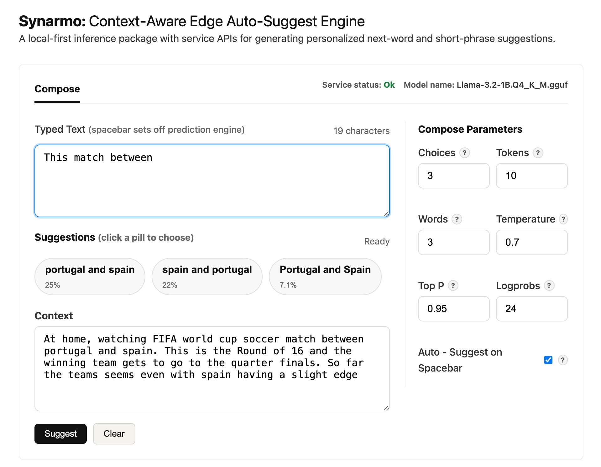

# Synarmo

[](https://github.com/vrraj/synarmo/actions)
[](https://pypi.org/project/synarmo/)
[](https://github.com/vrraj/synarmo/releases)

Synarmo (derived from *synarmozo* — "to fit together, to join closely") is a
local-first, low-latency auto-suggest engine and Python package for
personalized next-word and short-phrase predictions across messaging, chat, and
assistive typing workflows. It combines context-aware local inference, service
APIs, and llama.cpp/GGUF support for swappable local models.

```bash
# Install with llama.cpp and service support
pip install "synarmo[llama,service]"
```

Prefer a browser workflow? The source checkout includes an
[Interactive UI](#install---interactive-ui-git-clone) for testing and tuning
API calls with context and parameters.

> Local-first next-word and next-phrase suggestions tuned for short completions.

<video src="https://github.com/user-attachments/assets/ad153346-7b2c-42e8-a747-d4325a45672d" controls muted playsinline width="100%"></video>

<p align="center"><em>Synarmo context-aware compose loop predicting short suggestions locally.</em></p>

Synarmo is intended to be used as:

- a PyPI package for predicting suggestions from Python
- integration surfaces for other applications through REST and WebSocket
- an interactive browser `/ui` for testing and tuning API calls with context and parameters
- a llama.cpp/GGUF-backed engine that can run on CPU or supported GPUs such as
  Apple Metal, with model and GPU-layer settings controlled through `.env`

The primary path uses a local GGUF model for inference through llama.cpp. For
no-model verification checks of package install, CLI, service, or UI wiring, see
[Mock Mode](#mock-mode).

---

## Install - PyPI Package

Install Synarmo with llama.cpp and service support:

```bash
pip install "synarmo[llama,service]"
mkdir -p ~/models/synarmo
```

Create a `.env` file in the directory where you will run `synarmo` or your
Python app. This example assumes an Apple Silicon Mac with one integrated Metal
GPU:

```dotenv
LOCAL_MODELS_CACHE=~/models/synarmo
SYNARMO_MAX_SUGGESTIONS=3
SYNARMO_N_GPU_LAYERS=-1
SYNARMO_LLAMA_VERBOSE=0
SYNARMO_MODEL_REPO_ID=QuantFactory/Llama-3.2-1B-GGUF
SYNARMO_MODEL=Llama-3.2-1B.Q4_K_M.gguf
```

The first `--backend llama-cpp` command checks `LOCAL_MODELS_CACHE` and
downloads `SYNARMO_MODEL` from `SYNARMO_MODEL_REPO_ID` if the GGUF model file is
missing. The first model download can take some time, so the first real request
is slower than later runs. In a source checkout, you can do that check before
the first request with `make model-ensure`. See
[Configure A Local Model](#configure-a-local-model) for model paths and
[Infrastructure - llama.cpp Configuration](#infrastructure---llamacpp-configuration)
for CPU/GPU settings.

Then run Synarmo with the llama.cpp backend:

```bash
synarmo suggest "My goals" \
  --context "in the gym working out with a coach. I am looking to build strength and being able to run up a flight of stairs without tiring" \
  --backend llama-cpp
```

With that `.env`, the model is stored at:

```text
~/models/synarmo/Llama-3.2-1B.Q4_K_M.gguf
```

Later runs reuse the already downloaded file.

---

## Install - Interactive `/ui` (Git Clone)

Use the browser `/ui` to test local suggestions with context and autocomplete
parameters. It runs from a source checkout because it needs the FastAPI
service, static UI assets, and a virtual environment.



**Step 1 — Clone the repository:**

```bash
git clone https://github.com/vrraj/synarmo.git
cd synarmo
```

**Step 2 — Create a virtual environment and install with llama.cpp and service
extras:**

```bash
python3 -m venv .venv
source .venv/bin/activate
pip install -e ".[llama,service]"
```

The editable install makes the source checkout importable inside the virtual
environment, installs the `synarmo` command used by `make ux`, and adds the
FastAPI/uvicorn service dependencies for the browser UI. Add the `[dev]` extra
when running verification specs and linters.

**Step 3 — Configure a local GGUF model:**

```bash
cp .env.example .env
mkdir -p ~/models/synarmo
```

The included `.env.example` is configured for automatic download from Hugging
Face and assumes an Apple Silicon Mac with one integrated Metal GPU. See
[Configure A Local Model](#configure-a-local-model) for manual model paths and
other model options, and
[Infrastructure - llama.cpp Configuration](#infrastructure---llamacpp-configuration)
for CPU/GPU settings.

**Step 4 — Download or verify the local inference model:**

```bash
make model-ensure
```

This checks `LOCAL_MODELS_CACHE` and downloads `SYNARMO_MODEL` from
`SYNARMO_MODEL_REPO_ID` if the GGUF file is missing. `make ux` performs the
same model load when the service starts; running this first lets the download
finish before you open the UI. The first download can take some time.

**Step 5 — Start the service with real local inference:**

```bash
make ux
```

`make ux` starts the configured llama.cpp backend in the background, waits for
`/health`, and prints the browser UI URL.

**Step 6 — Open the UI shown by `make ux`:**

```text
http://127.0.0.1:8765/ui
```

The UI calls the same `/health` and `/evaluate/autocomplete` endpoints that a
client application can call directly.

**Stop the background service when you are done:**

```bash
make stop
```

---

### Configure A Local Model

To run real local inference, set up:

- the `llama-cpp` backend dependencies, installed with `[llama]`
- a `.env` file that tells Synarmo where to find the model

Place `.env` in the directory where you run `synarmo` or start your Python app.
Synarmo loads it when `SynarmoEngine.load()` runs.

For a source checkout, start from the included example:

```bash
cp .env.example .env
mkdir -p ~/models/synarmo
```

For PyPI installs, create `.env` in your app directory or the terminal
directory where you run `synarmo`:

```bash
mkdir -p ~/models/synarmo
```

Use this `.env` for automatic download from Hugging Face:

```dotenv
LOCAL_MODELS_CACHE=~/models/synarmo
SYNARMO_MAX_SUGGESTIONS=3
SYNARMO_N_GPU_LAYERS=-1
SYNARMO_LLAMA_VERBOSE=0
SYNARMO_MODEL_REPO_ID=QuantFactory/Llama-3.2-1B-GGUF
SYNARMO_MODEL=Llama-3.2-1B.Q4_K_M.gguf
```

When `SYNARMO_MODEL_REPO_ID` is set, `llama-cpp-python` checks
`LOCAL_MODELS_CACHE` and downloads `SYNARMO_MODEL` there if it is missing. With
the default values above, the downloaded file will be stored at:

```text
~/models/synarmo/Llama-3.2-1B.Q4_K_M.gguf
```

Use this `.env` for a manually downloaded model in the cache directory:

```dotenv
LOCAL_MODELS_CACHE=~/models/synarmo
SYNARMO_N_GPU_LAYERS=-1
SYNARMO_LLAMA_VERBOSE=0
SYNARMO_MODEL=Llama-3.2-1B.Q4_K_M.gguf
```

Relative model filenames are resolved from `LOCAL_MODELS_CACHE`, so the example
above points to:

```text
~/models/synarmo/Llama-3.2-1B.Q4_K_M.gguf
```

Use this `.env` for a model stored somewhere else:

```dotenv
SYNARMO_N_GPU_LAYERS=-1
SYNARMO_LLAMA_VERBOSE=0
SYNARMO_MODEL=/Users/raj/models/qwen2.5-1.5b-instruct-q4_k_m.gguf
```

For a one-off command, pass a model path directly:

```bash
synarmo suggest "My goals" \
  --backend llama-cpp \
  --model-path ~/models/synarmo/Llama-3.2-1B.Q4_K_M.gguf
```

Any llama.cpp-compatible GGUF model works this way. To try another family such
as Qwen, change `SYNARMO_MODEL_REPO_ID` and `SYNARMO_MODEL`, point
`SYNARMO_MODEL` at a different local `.gguf` file, or pass `--model-path`.

In a source checkout, these model commands are available:

```bash
make ux
make ux-mock
make stop
make models
make model-current
make model-ensure
```

`make model-ensure` checks model readiness once. For `llama-cpp`, it verifies
that the selected model is available and downloads it if needed. `synarmo serve
--backend llama-cpp` performs the same model load when the service starts.

---

## Infrastructure - llama.cpp Configuration

Synarmo uses `llama-cpp-python`, which packages the llama.cpp runtime used to
load GGUF models. The hardware behavior is controlled in two places:

- install/build options for `llama-cpp-python`
- the runtime layer offload setting passed to `llama_cpp.Llama`

The setup flow is:

```text
Install Synarmo with [llama]
  -> pip installs llama-cpp-python
  -> llama-cpp-python provides the available runtime backend
     (CPU, Apple Metal, CUDA, or another supported backend)
  -> .env sets SYNARMO_N_GPU_LAYERS
  -> Synarmo passes that value to llama_cpp.Llama as n_gpu_layers
  -> llama.cpp offloads that many model layers if the installed backend supports it
```

In short: `llama-cpp-python` determines what hardware backends exist; Synarmo's
`.env` setting determines how many model layers to ask llama.cpp to offload.

Synarmo exposes the runtime setting as:

```dotenv
SYNARMO_N_GPU_LAYERS=-1
```

`SYNARMO_N_GPU_LAYERS` is the number of transformer layers to offload to the
available GPU backend. It is not the number of GPUs.

The included `.env.example` assumes a modern Apple Silicon Mac with one
integrated Metal GPU:

```dotenv
SYNARMO_N_GPU_LAYERS=-1
```

The hard-coded fallback when no `.env` value is set remains CPU-only for
portability:

```dotenv
SYNARMO_N_GPU_LAYERS=0
```

An Apple M2 has one integrated GPU using unified memory. A 16 GB unified-memory
Mac is a comfortable baseline for local testing and leaves headroom for the
service, browser UI, and small quantized GGUF models. Smaller models can run
with less memory; larger models may need more memory or fewer offloaded layers.

| Value | Behavior | When to use |
| ---: | --- | --- |
| `0` | CPU inference | Portable default, CPU-only machines, or debugging GPU issues. |
| `-1` | Offload all possible layers | Apple Silicon with Metal, NVIDIA CUDA, or another supported GPU build. |
| positive integer | Offload only that many layers | Machines with limited GPU memory or when tuning heat/memory use. |

For native llama.cpp load diagnostics, temporarily enable:

```dotenv
SYNARMO_LLAMA_VERBOSE=1
```

That prints llama.cpp startup lines such as model metadata key-value counts,
tensor quantization types, model type and parameter count, KV cache size,
Metal/CUDA buffer sizes, and model size. Leave it `0` for normal service use.

### Apple M2 Performance Note

With the default 1B Q4_K_M GGUF model, Apple M2 Metal offload, and
`SYNARMO_N_GPU_LAYERS=-1`, local autocomplete evaluation on this Apple M2
setup commonly shows prefill/prompt evaluation around 50 tokens per second and
short generation reaching around 95-100 tokens per second on a lightly loaded
machine. Actual verbose logs may vary when other apps are active, when the
request is mostly prompt evaluation, or when only a few tokens are generated.
Use `SYNARMO_LLAMA_VERBOSE=1` to inspect the native `llama_perf_context_print`
timings for your own machine.

For this checkout on an Apple M2, `.env` uses:

```dotenv
SYNARMO_N_GPU_LAYERS=-1
```

That asks llama.cpp to use the M2 integrated GPU through Metal for all possible
model layers. Apple M2 has one integrated GPU device; the `-1` means "all
possible layers", not "one GPU".

### CPU-Only Setup

CPU-only users do not need special Metal, CUDA, or GPU build flags. Install the
normal llama extra and leave GPU offload disabled:

```bash
pip install -e ".[llama,service]"
```

```dotenv
SYNARMO_N_GPU_LAYERS=0
```

This is slower than GPU offload but is the most portable path.

### What The Install Step Builds

The README install commands install Synarmo's `[llama]` extra, which installs
`llama-cpp-python`:

```bash
pip install "synarmo[llama,service]"
pip install -e ".[llama,service]"
```

That package either installs a compatible wheel or builds its bundled
llama.cpp runtime during pip installation. CPU-only users usually do not need
any extra build command. Apple Silicon users should first try the normal
install with `SYNARMO_N_GPU_LAYERS=-1`; if GPU offload is not reported, force
the Metal rebuild below. NVIDIA users generally need a CUDA-enabled install or
rebuild before GPU offload will work.

### Apple Silicon / Metal Setup

On macOS, llama.cpp's current CMake build enables Metal by default, so the
normal README install is usually enough on an arm64 Python. If you need to
force a source rebuild of `llama-cpp-python` with Metal enabled, use the
current `GGML_METAL` option:

```bash
CMAKE_ARGS="-DGGML_METAL=on" pip install --upgrade --force-reinstall --no-cache-dir llama-cpp-python
```

If Python or the wheel architecture is wrong on Apple Silicon, force arm64 too:

```bash
CMAKE_ARGS="-DCMAKE_OSX_ARCHITECTURES=arm64 -DCMAKE_APPLE_SILICON_PROCESSOR=arm64 -DGGML_METAL=on" pip install --upgrade --force-reinstall --no-cache-dir llama-cpp-python
```

Then use:

```dotenv
SYNARMO_N_GPU_LAYERS=-1
```

### NVIDIA / CUDA Setup

NVIDIA GPUs need a CUDA-enabled `llama-cpp-python` build. The normal CPU wheel
does not become GPU-capable just because `SYNARMO_N_GPU_LAYERS=-1` is set.

For a source rebuild with CUDA enabled, install or reinstall
`llama-cpp-python` with:

```bash
CMAKE_ARGS="-DGGML_CUDA=on" pip install --upgrade --force-reinstall --no-cache-dir llama-cpp-python
```

Then use:

```dotenv
SYNARMO_N_GPU_LAYERS=-1
```

If GPU memory is limited, use a positive number instead of `-1` to offload only
some model layers.

### Verify CPU/GPU Support

Check the installed package version and architecture:

```bash
.venv/bin/python -c "import llama_cpp, platform; print(llama_cpp.__version__); print(platform.machine())"
```

Check whether the native runtime reports GPU offload support:

```bash
.venv/bin/python -c "from llama_cpp import llama_cpp; print(llama_cpp.llama_supports_gpu_offload())"
```

On macOS, check whether the installed `libllama` links the Metal backend:

```bash
otool -L .venv/lib/python3.13/site-packages/llama_cpp/lib/libllama.dylib
```

Look for `libggml-metal` in the output. To see llama.cpp's model-load logs,
temporarily run with verbose logging in the backend or a direct llama.cpp
command; Synarmo sets `verbose=False` during normal operation to keep CLI and
service output quiet.

---

## Interfaces At A Glance

| Interface | Use it for | Example |
| --- | --- | --- |
| Python API | Embed suggestions in another Python app | `SynarmoEngine.load(backend="llama-cpp").suggest("My goals")` |
| CLI | Run quick local prediction commands | `synarmo suggest "My goals" --backend llama-cpp` |
| Service Mode | Run Synarmo as a local server for app, UI, REST, or WebSocket clients | `synarmo serve --backend llama-cpp` |

Service mode starts one local Synarmo process, keeps the model warm, and makes
that model available over local endpoints:

| Endpoint | Use it for |
| --- | --- |
| `GET /health` | Check that the service is ready and see the active backend/model. |
| `POST /suggest` | Request suggestions from an app, script, keyboard, or other client. |
| `POST /evaluate/autocomplete` | Test autocomplete parameters; this is the endpoint used by `/ui`. |
| `WebSocket /ws/suggest` | Keep a live suggestion channel open while a user types. |
| `GET /ui` | Open the browser interface for testing and tuning suggestions. |

Minimal REST request:

```bash
curl -X POST http://127.0.0.1:8765/suggest \
  -H 'content-type: application/json' \
  -d '{"text":"My goals","context":"in the gym working out with a coach. I am looking to build strength and being able to run up a flight of stairs without tiring"}'
```

---

## Integration Details

### Python API

Use `SynarmoEngine` when embedding prediction into another Python app:

```python
from synarmo import SynarmoEngine

engine = SynarmoEngine.load(
    backend="llama-cpp",
    max_suggestions=3,
    max_suggestion_words=4,
    temperature=0.25,
    top_p=0.95,
    max_tokens=5,
)

suggestions = engine.suggest(
    text="My goals",
    context="in the gym working out with a coach. I am looking to build strength and being able to run up a flight of stairs without tiring",
)

print([item.text for item in suggestions])
```

For a one-off call:

```python
import synarmo

suggestions = synarmo.predict(
    text="My goals",
    context="in the gym working out with a coach. I am looking to build strength and being able to run up a flight of stairs without tiring",
    backend="llama-cpp",
    max_suggestions=3,
    max_suggestion_words=4,
    temperature=0.25,
    top_p=0.95,
    max_tokens=5,
)
```

The engine loads the model once and reuses it for later predictions when used
as an object or service. If `SYNARMO_MODEL_REPO_ID` is configured and the GGUF
file is missing, this first load downloads the model before returning
suggestions, which can take some time.

After changing code or prompt text, restart any running `synarmo serve`
process so the service reloads the updated Python modules and prompt
construction. The service keeps the model warm while it is running.

### Service Mode

Service mode runs Synarmo as a local server for clients outside the Python
process. Use it when another process needs suggestions, such as a desktop app,
web app, keyboard, browser UI, or a client that wants REST or WebSocket access.
The service loads the selected backend once, keeps the model warm, and exposes
local endpoints from the same engine instance.

Start the local service with the configured `.env` model:

```bash
synarmo serve --backend llama-cpp
```

If `SYNARMO_MODEL_REPO_ID` is configured and the GGUF file is missing, service
startup downloads it before `/health` is ready, which can take some time. If
you pass a direct `--model-path`, that local file must already exist.

When using `pyenv` and a specific local GGUF file:

```bash
pyenv exec synarmo serve \
  --backend llama-cpp \
  --model-path ~/models/synarmo/Llama-3.2-1B.Q4_K_M.gguf
```

The service defaults to:

```text
http://127.0.0.1:8765
```

Once it is running, use these local endpoints:

| Endpoint | What it does |
| --- | --- |
| `GET /health` | Confirms the service is ready and reports the active backend/model. |
| `POST /suggest` | Returns ranked suggestions for text and optional context. |
| `POST /evaluate/autocomplete` | Returns autocomplete candidates and token scores for tuning. |
| `WebSocket /ws/suggest` | Accepts repeated suggestion requests over one live connection. |
| `GET /ui` | Opens the browser UI backed by the same service. |

Check health from another terminal:

```bash
curl http://127.0.0.1:8765/health
```

The health response includes runtime diagnostics such as `n_gpu_layers`,
`requested_gpu_layers`, `gpu_offload_supported`, `llama_verbose`, and the model
layer count when reported by the installed llama.cpp runtime. `synarmo serve`
prints the same summary when the service starts. Set `SYNARMO_LLAMA_VERBOSE=1`
before startup to include the native llama.cpp model-loader log lines.

### Test And Tune With `/ui`

The browser UI is for tuning API calls before building a production client. It
lets you:

- type the current message
- provide conversation or scene context
- change autocomplete parameters such as choices, candidate words, temperature,
  top-p, and logprob pool
- inspect how the service responds

#### Compose Parameters

| Parameter | Default | What it does |
| --- | ---: | --- |
| Choices | 3 | Number of suggestions to show. |
| Tokens | 5 | Maximum generated tokens behind each suggestion. Higher values allow longer completions but can take longer. |
| Words | 1 | Maximum words displayed for each suggestion. |
| Temperature | 0.5 | Controls randomness. Lower is more predictable; higher is more varied. |
| Top P | 0.95 | Nucleus sampling value passed to the one-token llama.cpp probe. |
| Logprobs | 24 | Number of top next-token log probabilities to request from llama.cpp for starter selection. |
| Auto - Suggest on Spacebar | On | Automatically asks for new suggestions after typing a space. |

For autocomplete, Synarmo uses `Logprobs` as the starter pool size. It asks
llama.cpp for a one-token probe with `logprobs` enabled, sorts the returned
next-token probabilities, removes duplicate first-word starters, and expands up
to `Choices` starters into short suggestions. `Top P` is passed to the probe
sampling call; the follow-up expansion for each selected starter is
deterministic.

#### How The Autocomplete Flow Works

With the llama.cpp backend, this same autocomplete flow powers
`synarmo.predict()`, `engine.suggest()`, REST `/suggest`, WebSocket
`/ws/suggest`, and the browser `/ui`.

Suppose the current text is:

```text
I want to
```

Synarmo first asks the model for likely next-token starters. The top scored
starters might be:

```text
go
eat
help
```

Those starters become the beginning of each candidate:

```text
I want to go
I want to eat
I want to help
```

Then Synarmo expands each starter just enough to make a cleaner word or short
phrase:

```text
go outside
eat lunch
help me
```

`Tokens` controls the internal room the model has for that expansion. `Words`
controls how many whitespace-separated words are kept for display. For example,
if the model produces:

```text
go outside with my friends
```

then the displayed suggestion depends on `Words`:

```text
Words = 1  -> go
Words = 2  -> go outside
Words = 3  -> go outside with
```

This autocomplete strategy uses logprobs to pick strong starter tokens, then
makes one short deterministic expansion call for each starter.

### Use Service Endpoints

Basic suggestions:

```bash
curl -X POST http://127.0.0.1:8765/suggest \
  -H 'content-type: application/json' \
  -d '{"text":"My goals","context":"in the gym working out with a coach. I am looking to build strength and being able to run up a flight of stairs without tiring"}'
```

Autocomplete evaluation used by `/ui`:

```bash
curl -X POST http://127.0.0.1:8765/evaluate/autocomplete \
  -H 'content-type: application/json' \
  -d '{
    "text": "My goals",
    "contexts": ["in the gym working out with a coach. I am looking to build strength and being able to run up a flight of stairs without tiring"],
    "choices": 3,
    "candidate_tokens": 5,
    "candidate_words": 2,
    "temperature": 0.5,
    "top_p": 0.95,
    "logprob_pool": 24
  }'
```

WebSocket clients can connect to:

```text
ws://127.0.0.1:8765/ws/suggest
```

and send:

```json
{"text": "My goals", "context": "in the gym working out with a coach. I am looking to build strength and being able to run up a flight of stairs without tiring"}
```

### CLI Suggestion Loop

Run a single suggestion request:

```bash
synarmo suggest "My goals" \
  --context "in the gym working out with a coach. I am looking to build strength and being able to run up a flight of stairs without tiring" \
  --backend llama-cpp
```

Run the terminal compose loop:

```bash
synarmo compose "My goals" \
  --context "in the gym working out with a coach. I am looking to build strength and being able to run up a flight of stairs without tiring" \
  --backend llama-cpp
```

`compose` shows suggestions, lets you choose one, appends it to the typed
text, and immediately predicts the next suggestions.

Expected shape:

```text
My goals
1. go outside
2. have water
3. talk to you
Choose 1-3, enter custom text, or q to quit:
```

---

## Mock Mode

Mock mode is a deterministic development backend for verifying Synarmo without a
GGUF model, llama.cpp setup, or model download. It returns canned short
suggestions and sends them through the same context, prompt, service, and
ranking pipeline used by the real backend.

Use it to check:

- Python package imports and API calls
- CLI wiring for `suggest` and `compose`
- FastAPI startup, `/health`, `/suggest`, and `/evaluate/autocomplete`
- browser `/ui` request and rendering behavior
- deterministic verification specs and CI runs
- suggestion parsing, deduping, filtering, truncation, and max suggestion count

Install the lightweight package and run a no-model API check:

```bash
pip install synarmo
python -c "from synarmo import SynarmoEngine; e=SynarmoEngine.load(); print([s.text for s in e.suggest('I want to')])"
```

From a source checkout, run the verification specs without downloading a model:

```bash
pip install -e ".[dev]"
PYTHONPATH=src pytest
```

The files under `tests/` are production behavior verification specs. For
example, `test_engine.py` verifies prediction behavior, `test_config.py`
verifies configuration contracts, and `test_service.py` verifies service/API
contracts.

Start the service or browser UI with the mock backend:

```bash
synarmo serve --backend mock
make ux-mock
```

Use `--backend llama-cpp` when checking real suggestion quality, model latency,
memory usage, token probabilities, or how a specific GGUF model behaves.

---

## Use Cases

- messaging, email, or chat clients that need short completions inline
- assistive typing workflows where each keystroke matters
- local or air-gapped deployments that keep user text off remote APIs
- desktop and browser clients that need a local prediction service
- mobile keyboards or apps that need consistent suggestion behavior across
  contexts

---

## How It Works

Synarmo separates UI concerns from the reusable engine. The core package
covers context assembly, personalization memory, prompt construction,
inference, and ranking. Applications call the Python API directly or
communicate with the local FastAPI service.

The reusable package contains the prediction engine:

- `synarmo` Python package for inference, context assembly, prompt
  construction, user memory, ranking, and configuration
- GGUF inference through `llama.cpp` / `llama-cpp-python`
- local service mode for desktop, web, keyboard, mobile, or other clients
- interactive `/ui` to test and evaluate autocomplete requests with different
  contexts and compose token-prediction parameters, before building a client
  against service endpoints

The model layer is intentionally swappable at the GGUF level. If another
model works with llama.cpp, Synarmo can test it by changing model
configuration while keeping application code stable.

## Extending Inference & Mobile Direction

Synarmo currently ships with a `llama-cpp` runtime backend for local GGUF
model inference. The core engine is designed around a small backend boundary:

```python
class ModelBackend(Protocol):
    name: str

    def generate(self, prompt: str, options: GenerationOptions) -> str:
        ...
```

That means the prompt builder, context assembly, ranking, CLI, and service
APIs can stay stable while a new runtime adapter implements `generate(...)`.
Additional runtimes such as ONNX, MLX, Core ML, or a mobile-specific
llama.cpp adapter can plug in through the same boundary with their own backend
implementation, tokenizer/model loading, decoding loop, sampling behavior, and
tests.

The next product step is a mobile app that uses the same prediction flow with
an on-device model. Synarmo is also intended to serve as a portable reference
implementation for smartphone apps — the Python package defines the
prediction flow, API shape, prompting, context handling, and ranking behavior
that can be reimplemented in a native mobile client with an on-device model
runtime:

- on-device GGUF/Core ML/MLX-style model runtime where appropriate
- shared prompt, memory, and ranking concepts
- local-first prediction loop tuned for short suggestions

See [docs/ARCHITECTURE.md](docs/ARCHITECTURE.md) for design notes and mobile
direction.

## Repository Layout

```text
src/synarmo/
  engine.py              # Python prediction API
  config.py              # Runtime and model configuration
  context.py             # Context assembly
  memory.py              # Local user profile data
  prompts.py             # Prompt construction
  suggestions.py         # Suggestion ranking and filtering
  models/                # Model backends
  service/               # FastAPI app factory
  ui/                    # Local UI assets
docs/
  ARCHITECTURE.md
```

## License

MIT License - see LICENSE file for details.

## Contributing

Contributions welcome! Please feel free to submit a Pull Request.
